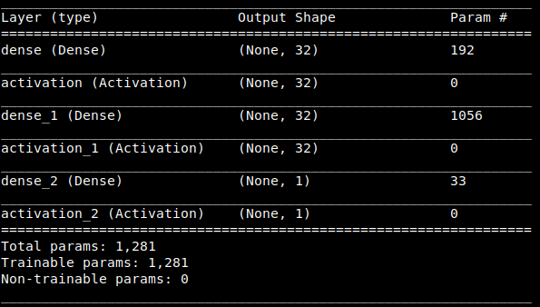
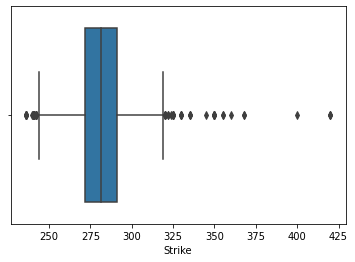
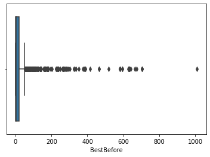

# EUBOPA
European Basket Option Pricing Approaches

## Table of Contents

- [EUBOPA](#eubopa)
  * [Scope](#scope)
  * [Objective](#objective)
  * [Problem Statement](#problem-statement)
  * [Definitions of Financial References](#definitions-of-financial-references)
    + [Black-Scholes Formula](#black-scholes-formula)
    + [Black_Scholes Assumptions](#black-scholes-assumptions)
    + [geomteric Brownian Motion (gBM)](#geomteric-brownian-motion--gbm-)
    + [Monte Carlo Method](#monte-carlo-method)
    + [Europan Basket Option](#europan-basket-option)
  * [1. Introduction](#1-introduction)
  * [2.  Data set](#2--data-set)
    + [2.1. Data set Description](#21-data-set-description)
  * [3. Assumptions attached to this project](#3-assumptions-attached-to-this-project)
- [GOAL 1](#goal-1)
  * [4. ANN Model](#4-ann-model)
    + [4.1. ANN Architecture](#41-ann-architecture)
    + [4.2. Input Features](#42-input-features)
    + [4.3. Hyperparameters](#43-hyperparameters)
  * [Limitations and Known Bugs](#limitations-and-known-bugs)
  * [Code and Repository](#code-and-repository)
    + [Environment Setup:](#environment-setup-)
    + [Usage:](#usage-)
    + [Examples](#examples)
      - [1. Black-Scholes Pricing](#1-black-scholes-pricing)
      - [2. Neural Network Pricing](#2-neural-network-pricing)
      - [3. Monte-Carlo Pricing](#3-monte-carlo-pricing)
  * [EDA](#eda)
- [Goal 2](#goal-2)
  * [Comparison between Neural Network and Monte Carlo Numerical Method](#comparison-between-neural-network-and-monte-carlo-numerical-method)
- [Goal 3](#goal-3)
  * [Comparison of Analytical Method (Black-Scholes Pricing) vs Neural Network bs Monte Carlo Numerical Method](#comparison-of-analytical-method--black-scholes-pricing--vs-neural-network-bs-monte-carlo-numerical-method)
  * [Future Direction & Improvements](#future-direction---improvements)
  * [References](#references)

[comment]: <> (<small><i><a href='http://ecotrust-canada.github.io/markdown-toc/'>Table of contents generated with markdown-toc</a></i></small>)


## Scope
This project is designed to fulfil the assessment requirements for the Machine Learning Engineer post at Multiverse 
Computing.

## Objective
The objective of this assessment task is to develop three different approaches from three mathematical domains that can 
be used to value a stock option and then compare the results.

## Problem Statement
The client wants to explore novel methodologies for accelerating the pricing of exotic derivatives.
A neural network is to be designed for pricing the European Basket options under Black-Scholes assumptions. Once done, 
the prices predicted by the trained model are to be compared with a traditional numerical solver for option pricing. 
Lastly, the results of both the strategies are to be compared against an analytical solution for a single asset.

## Definitions of Financial References
* ### Black-Scholes Formula

    This is a globally acceptable model of Quantitative Finance to price the derivatives under some fixed assumptions. 
    This formula provides a closed-form solution to the price of an option hence making it analytical in nature.

* ### Black_Scholes Assumptions

  1. Markets are fair. No transcation costs and no hiccups.
  2. The under-lying asset follows the log-normal distribution.
  3. Volatility and Risk-Free interest rate are constant and known.
  4. This is valid only for European options which can only be exercised on the expiration date.
  5. No dividends are paid out during the life of the option.
                                                           
    
    The above assumptions are also valid for the implementation of this project

* ### geomteric Brownian Motion (gBM)
    A mathematical model that is used to predict the future paths of an under-lying asset given that asset is following
    a Brownian Motion. In simple terms, this model helps predict the random walk of a stock price.

* ### Monte Carlo Method
    This is a numerical method that is used to foresee the life of an asset or a stock that is following a gBM.
* ### Europan Basket Option
    Basket options are based on more than one underlying assets which can only be exercised on the date of expiration. 
    The payoff of a basket option is essentially the weighted average of all underlying assets.  

## 1. Introduction

Option price prediction is the “act of determining” the buy or sell value of a stock option traded on an exchange. The 
successful prediction of a option price could yield significant profit.
In this project, I have proposed a option pricing model using Artificial Neural Networks. This technique utilises 
**five** distinct features as the input parameters for training, and gives ‘Call Price’ for a European stock as the 
output.

## 2.  Data set

The requirement was to design a model for the pricing of an **European Basket Option**. After a lot of research, I 
found a raw data of stock options on [Kaggle](https://www.kaggle.com/bendgame/options-market-trades). 

### 2.1. Data set Description

There was no metadata attached to this dataset. I found following information while exploring this data.

         Entity                              |                    Description
         ------------------------------------|-----------------------------------------------------------------
         Total observations in the data      |                      62795
         Total trade symbols in the data     |                      2346
         Highest observation in all the data | [SPY (SPDR S&P 500 Trust ETF)](https://finance.yahoo.com/quote/SPY/)
         Total Count of SPY observations     |                      4455

As being one of the most frequent stock in the given data, I chose to work with SPY symbol. Furthermore, I selected only
the call options for the SPY dataset.

## 3. Assumptions attached to this project

1. The first assumption undertaken is that the data of SPY company is representing a weighted average of multiple 
underlying assets making it a basket option.
2. The option will only be exercised on the expiration date hence it is a European option.
3. **Volatility**, ```v```, is calculated by the following formula.


where;

* sigma is the standard deviation 
* ```N``` = total no. of unique days in which the trading of asset of interest happened 

Using this formula, the volatility was fixed at ```0.031802533217352```

4. Adherence to the assumption no. 3 makes the whole project to be operating in the Black-Scholes world. 
5. Risk-Free Interest Rate is set as the 10-year US treasury yield from Yahoo Finance API. At the time of data processing 
   for this project, the risk-free interest rate was ```0.012580000162125```
6. Target variable ```Y``` for the Neural Network was set to be the Black-Scholes price of each training example. This
was decided due to lack of actual trade value of the option in the primary dataset.

# GOAL 1
## 4. ANN Model
ANNs are composed of multiple nodes, which imitate biological neurons of human brain. The neurons are connected by links
and they interact with each other. The nodes can take input data and perform simple operations on the data. The result 
of these operations is passed to other neurons. The output at each node is called its activation or node value.Each 
link is associated with weight.

### 4.1. ANN Architecture

For this project, a simple ANN architecture was designed using Keras API with TensorFlow backend. Model summary is given
as follows.




  


### 4.2. Input Features

Following were set at the input features to this ANN model.
  * Stock Price
  * Strike Price
  * Volatility
  * Risk Free Interest Rate
  * Time left in expiration

 
Training set is given at the following location in the repo.
```<root>/training/baseline.csv```

### 4.3. Hyperparameters

For the initial model following hyperparamters were kept.

HyperParameter  | Value
--------------- | -------------
Loss Function   | Mean Squared Error Loss
Optimizer       | Adam (per-parameter adaptive learning rate)
Training Epochs | 100
Train:Test:Val  | 70:15:15 split
Depth           | 2
Activation for hidden layers | Rectified Linear Unit (ReLU)
Activation of output Layer | Linear
Batch Size for last training | 16

## Limitations and Known Bugs
There were certain limitation that was faced at different steps while completing this assessment. I would like to mention 
some here.

1. Due to the limited background information about the Quantitative Finance domain, I spent a major section of the given
   time to carefully understand the actual requirement.
2. I didn't find a workable dataset which has the actual price of the option given in it. According to what I learned, I 
   needed the actual price inorder to calculate the **Implied Volatility** of the asset so that I may then use it.
3. Due to time constrained assessment, I have put my core attention to figuring out the requirement. I have tried to submit
   a working codebase that can be used to check the understanding of the whole assessment.
4. Although the training loss of the network was decreased to a very considerable extent, however, the predictions and 
   comparison was coming up quite off the mark. This is due either error-prone dataset or the incorrect implementation of
   volatility calculation.
5. Monte-Carlo implementation has an underlying assumption that the ```drift``` will always be ```0.8``` which is due to 
   partial knowledged about the geometeric Brownian Motion parameters.

## Code and Repository

This code should work with``` Python >= 3.6```

### Environment Setup:
  ```pip3 install -r requirements.txt```

### Usage:
 The main functionality of the three requirements mentioned in the assessment is implemented in ```runner.py``` file.

``runner.py`` run in 3 modes and requires two input parameters.

* ```--mode, -m``` : model used for predicting pricing
  * ```bs```: Black-Sholes model pricing
  * ```dl```: Neural-Network model based pricing
  * ```nm```: Numerical method based pricing i.e. Monte-Carlo pricing
* ```--data, -d```: accepts a file or an input from ```stdin```
  * valid json object
  * data.json is given in this repo can be used to give any custom input to any specific mode

### Examples
#### 1. Black-Scholes Pricing

  ```python runner.py -m bs -d data.json ```

  Output:

  ```Black-Scholes price for this European Call option = 11.308008169966485```


#### 2. Neural Network Pricing

  ```python runner.py -m dl -d data.json```

Output:

```Neural network prediction price for this European Call option = 428.5238037109375```

#### 3. Monte-Carlo Pricing

```python runner.py -m nm -d data.json ```

Output:

```Monte-Carlo price for this European Call option = 784.3592326252033```


## EDA
Due to limited time, an extensive Exploratory Data Analysis couldn't be completed for the acquired data. However, following 
observation were made.

The overall distribution of the training data for SPY stock option is given below.




* As we can see from the above plot that there are approx 21 observations where of strike price is quite away from the 
75% quartile of the distribution, hence we need to look further into the possibility of normalizing data and handling 
these outliers.



* As we can see from the above plot that the max value of 100+ observation of time left in expiration are aways from the
from the top whisker of the box plot indicating the density of outliers in the upper and lower bounds of this variable.

# Goal 2
## Comparison between Neural Network and Monte Carlo Numerical Method

According to the trained model, the values of Monte Carlo and NN are not making too much sense to be reflecting any 
meaningful pricing. This indicates a problem with either the dataset or the volatility calculation used to set the constant.


# Goal 3
## Comparison of Analytical Method (Black-Scholes Pricing) vs Neural Network bs Monte Carlo Numerical Method
While looking at the results, the Black-Scholes pricing seems to be the most reasonable and correct against the NN, and
Monte-Carlo method. Part of this behavior is due to the fact that Black-Scholes pricing is used as the target variable 
in the training of the Neural network giving it an edge of being the ground truth. Dataset, however, needs to be discussed with a domain expert.


## Future Direction & Improvements
1. Exploratory Data Analysis of the data in hand to normalize the data for better and cleaner training.
2. Tabular comparison of the results from analytical, neural network and Monte Carlo approaches 
3. **Get the input data vetted by a domain expert to mitigate the inaccuracies.**
4. Introduce Heston Volatility and then retrain the network releasing the assumption of fixed volatility.
5. Employ GridSearch to look for best hyper-parameter given that the input data is sound and correct.
6. Use LSTM network to capture the information for date of trading to learn the underlying pattern.
7. Better intuition of Volatility for Black-Scholes fixed ```v``` calculation to mitigate the error in current implementation.
8. **There was a fake news release from Bloomberg on 17-07-2015 about the acquisition of Twitter for 31B USD. This happened 
   around 11:35 am on that day. If I can get that data, I can calculate volatility as the weighted average of the X 
   timestamp and thus can have an organic volatility for training. This will enable me to release the assumption of constant 
   volatility from the Black-Scholes and the resulting NN implementation can have a very interesting result.**
9. Explore the numerical methods in more detail inorder to better implement the current version.
10. Dataset for BitCoin and Tesla stock comparison can be scoured to study the impact of Tesla accepting and then dropping the 
    BitCoin as their payment option thus disrupting the crypto market quite heavily a while ago.
11. Expand on my understanding of the quantitative finance domain to better study the market trends and nomenclature.
12. Keep the Learn, Try, Repeat cycle going in full swing.

## References
1. https://www.nasdaq.com/market-activity/stocks/twtr/option-chain
2. https://cs230.stanford.edu/projects_fall_2019/reports/26260984.pdf
3. https://www.researchgate.net/publication/220204936_A_neural_network_model_for_estimating_option_prices
4. https://www.weareworldquant.com/en/thought-leadership/beyond-black-scholes-a-new-option-for-options-pricing/
5. https://www.kaggle.com/bendgame/options-market-trades
6. https://www.khanacademy.org/economics-finance-domain/core-finance/derivative-securities/black-scholes/v/implied-volatility
7. https://stienstraw-9633.shinyapps.io/ML-Presentation/#9
8. https://towardsdatascience.com/monte-carlo-pricing-in-python-eafc29e3b6c9
9. https://github.com/RomanMichaelPaolucci
10. https://corporatefinanceinstitute.com/resources/knowledge/trading-investing/exotic-options/
11. https://www.investopedia.com/ask/answers/032515/what-options-implied-volatility-and-how-it-calculated.asp
12. https://www.investopedia.com/terms/v/volatility.asp
13. https://www.investopedia.com/terms/h/heston-model.asp
